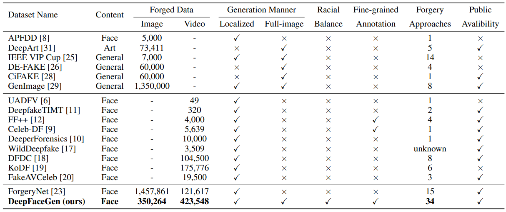

# DeepFaceGen: A Large-scale Universal Evaluation Benchmark For Face Forgery Detection (Updating)
> Abstract: With the rapid development of AI-generated content (AIGC) technology, the production of realistic fake facial images and videos that deceive human visual perception has become possible. Consequently, various face forgery detection techniques have been proposed to identify such fake facial content. However, evaluating the effectiveness and generalizability of these detection techniques remains a significant challenge. To address this, we have constructed a large-scale evaluation benchmark called DeepFaceGen, aimed at quantitatively assessing the effectiveness of face forgery detection and facilitating the iterative development of forgery detection technology. DeepFaceGen consists of **776, 990** real face image/video samples and **773, 812** face forgery image/video samples, generated using **34** mainstream face generation techniques. During the construction process, we carefully consider important factors such as content diversity, fairness across ethnicities, and availability of comprehensive labels, in order to ensure the versatility and convenience of DeepFaceGen. Subsequently, DeepFaceGen is employed in this study to evaluate and analyze the performance of **13** mainstream face forgery detection techniques from various perspectives. Through extensive experimental analysis, we derive significant findings and propose potential directions for future research.
<p align="center"> 

</p>

## Dataset Construction
```
Image Real Subsets 
├── Celeb-DF
│   ├── *.png
├── ForgeryNet
│   ├── *.jpg
├── real_image_labels_relative.csv (It contains the file paths of all the image-level real samples in the dataset)

Image Forged Subsets (27 mainstream face generation techniques)
├── SD1
│   ├── output_0.png
│   ├──...
│   ├── output_40319.png
├── tra_FSGAN
│   ├── Output00000.jpg
│   ├──...
│   ├── Output10499.jpg
├──...
├── pix2pix
│   ├── fake00001.png
│   ├──...
│   ├── fake10000.png
├── i2i_image_labels_relative.csv (It contains the file paths of all the image2image forged samples in the dataset)
├── t2i_image_labels_relative.csv (It contains the file paths of all the text2image forged samples in the dataset)
├── tra_image_labels_relative.csv (It contains the file paths of all the localized editing-based forged samples in the dataset)

Video Real Subsets 
├── CMLR
│   ├── *.mp4
├── ForgeryNet
│   ├── *.mp4
├── Celeb-DF
│   ├── *.mp4
├── CN-CVS
│   ├── *.mp4
├── real_video_labels_relative.csv (It contains the file paths of all the video-level real samples in the dataset)

Video Forged Subsets (16 mainstream face generation techniques)
├── Animatediff-rs
│   ├── output_0.mp4
│   ├──...
│   ├── output_40319.mp4
├── tra_FaceShifter
│   ├── Output_2_000000.mp4
│   ├──...
│   ├── Output078721.mp4
├──...
├── t2v_video_labels_relative.csv (It contains the file paths of all the text2video forged samples in the dataset)
├── tra_video_labels_relative.csv (It contains the file paths of all the localized editing-based forged samples in the dataset)
```
## Download Data
DeepFaceGen consists of **776, 990** real face image/video samples and **773, 812** face forgery image/video samples. The complete dataset is obtained as follows.
   - **[Image Real Subsets]**
     - Baiduyun: [this link](https://pan.baidu.com/s/1DqKtDQBw20dd9Ry1gzkTXg), code: 6666
   - **[Image Forged Subsets]**
     - Baiduyun: [this link](https://pan.baidu.com/s/1DqKtDQBw20dd9Ry1gzkTXg), code: 6666
   - **[Video Real Subsets]**
     - Baiduyun: [this link](https://pan.baidu.com/s/1DqKtDQBw20dd9Ry1gzkTXg), code: 6666
   - **[Video Forged Subsets]**
     - Baiduyun: [this link](https://pan.baidu.com/s/1DqKtDQBw20dd9Ry1gzkTXg), code: 6666
## Benchmark
For code reproducibility, we conducted a comprehensive benchmark performance evaluation using **13** mainstream face forgery detection techniques. All the code is sourced from the following github projects. 
- **[DASH-Lab/FakeAVCeleb](https://github.com/DASH-Lab/FakeAVCeleb)**, they provide executable code for MesoNet, EfficientNet-B0, Xception, and F3-Net at the video-level.
- **[erprogs/CViT](https://github.com/erprogs/CViT)**, they provide executable code for CViT at the video-level.
- **[liangchen527/SLADD](https://github.com/liangchen527/SLADD)**, they provide executable code for SLADD at the video-level.
- **[QingyuLiu/Exposing-the-Deception](https://github.com/QingyuLiu/Exposing-the-Deception)**, they provide executable code for Exposing at the video-level.


Thank you for your contributions to this project and the field!
