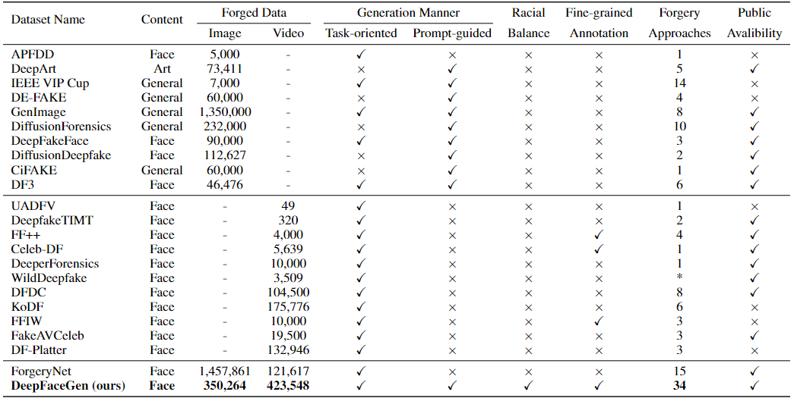
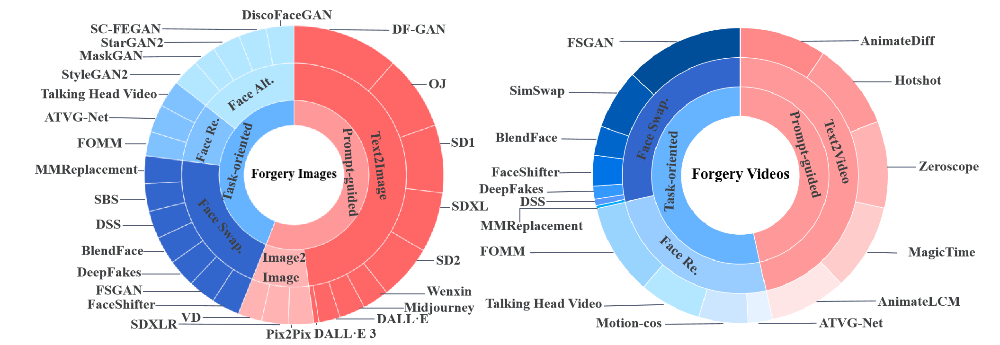

# DeepFaceGen: A Large-scale Universal Evaluation Benchmark For Face Forgery Detection

# ❗️❗️❗️The detailed experiments of the paper can be found in the: [Appendix](Appendix.md).**
[](https://creativecommons.org/licenses/by-nc/4.0/)  
> Abstract: With the rapid development of AI-generated content (AIGC) technology, the production of realistic fake facial images and videos that deceive human visual perception has become possible. Consequently, various face forgery detection techniques have been proposed to identify such fake facial content. However, evaluating the effectiveness and generalizability of these detection techniques remains a significant challenge. To address this, we have constructed a large-scale evaluation benchmark called DeepFaceGen, aimed at quantitatively assessing the effectiveness of face forgery detection and facilitating the iterative development of forgery detection technology. DeepFaceGen consists of **776, 990** real face image/video samples and **773, 812** face forgery image/video samples, generated using **35** mainstream face generation techniques. During the construction process, we carefully consider important factors such as content diversity, fairness across ethnicities, and availability of comprehensive labels, in order to ensure the versatility and convenience of DeepFaceGen. Subsequently, DeepFaceGen is employed in this study to evaluate and analyze the performance of **20** mainstream face forgery detection techniques from various perspectives. Through extensive experimental analysis, we derive significant findings and propose potential directions for future research.
<p align="center"> 

</p>


>   **News:**
>  **NEW DATA**: We have continuously updated the **DeepSeek Janus-Pro** face generation dataset. The design of prompt instructions follows the processing pipeline outlined in [Pipeline of Prompts Construction](./app3.jpg). After applying **skin tone balancing** and removing **low-quality data**, we have synchronized **18,218 DeepSeek Janus-Pro samples** to [this Google Driver link](https://drive.google.com/file/d/1pL0QoBdg9sS9mVwgL0j-exAR70H5RyCs/view?usp=drive_link).
The experimental results for **Train on All and Test on All** and **Train on One and Test on All** are presented in the table below.

>### Train on One and Test on All (AUC,%)
>
>| Model              | Xception | EN-B0  | F3-Net | RECCE | DNADet | DIRE  | UnivFD | FreqNet | DRCT  | NPR   |
>|--------------------|----------|--------|--------|-------|--------|-------|--------|---------|-------|-------|
>| DeepSeek Janus-Pro | 82.06    | 67.88  | 84.60  | 88.93 | 83.21  | 84.62 | 85.55  | 80.61   | 90.01 | 89.43 |


>### Train on All and Test on All (AUC,%)
>
>| Model              | Xception | DRCT   | F3-Net | UnivFD | RECCE | FreqNet | EN-B0  | DIRE  | DNADet | NPR   |
>|--------------------|----------|--------|--------|--------|-------|---------|--------|-------|--------|-------|
>| DeepSeek Janus-Pro | 86.74    | 80.40  | 86.71  | 97.63  | 92.00 | 92.40   | 87.42  | 91.44 | 92.45  | 93.60 |


## Dataset Construction
```
Image Real Subsets 
├── Celeb-DF
│   ├── 0_celebA-HQ.jpg
│   ├──...
│   ├── 9999_celebA-HQ.jpg
│   ├──00000
│   │  ├── 0_YouTube-real.png
│   ├──...
├── ForgeryNet
│   ├── real000001.jpg
│   ├──...
│   ├── real463101.jpg
├── real_image_labels_relative.csv (It contains the file paths of the image-level real samples in the dataset except for the added celebA-HQ.)
├── real_celebA-HQ_labels_relative.csv (celebA-HQ is the newly added data. It contains the file paths of celebA-HQ samples.)

Image Forged Subsets 
├── SD1
│   ├── output_0.png
│   ├──...
│   ├── output_40319.png
├── tra_FSGAN
│   ├── Output00000.jpg
│   ├──...
│   ├── Output10499.jpg
├──...
├── pix2pix
│   ├── fake00001.png
│   ├──...
│   ├── fake10000.png
├── i2i_image_labels_relative.csv (It contains the file paths of all the image2image forged samples in the dataset.)
├── t2i_image_labels_relative.csv (It contains the file paths of all the text2image forged samples in the dataset.)
├── tra_image_labels_relative.csv (It contains the file paths of all the localized editing-based forged samples in the dataset.)

Video Real Subsets 
├── CMLR
│   ├── *.mp4
├── ForgeryNet
│   ├── *.mp4
├── Celeb-DF
│   ├── *.mp4
├── CN-CVS
│   ├── *.mp4
├── real_video_labels_relative.csv (It contains the file paths of all the video-level real samples in the dataset.)

Video Forged Subsets 
├── Animatediff-rs
│   ├── output_0.mp4
│   ├──...
│   ├── output_40319.mp4
├── tra_FaceShifter
│   ├── Output_2_000000.mp4
│   ├──...
│   ├── Output078721.mp4
├──...
├── t2v_video_labels_relative.csv (It contains the file paths of all the text2video forged samples in the dataset.)
├── tra_video_labels_relative.csv (It contains the file paths of all the localized editing-based forged samples in the dataset.)
```
<p align="center"> 

</p>

## Download Data
DeepFaceGen consists of **776, 990** real face image/video samples and **773, 812** face forgery image/video samples. The dataset contains the following four parts.
   - **Image Real Subsets (It is composed of Celeb-DF and ForgeryNet.)**
   - **Image Forged Subsets (It is composed of 27 categories generating by mainstream face generation techniques.)**
   - **Video Real Subsets (It is composed of CMLR, ForgeryNet, Celeb-DF and CN-CVS.)**
   - **Video Forged Subsets (It is composed of 16 categories generating by mainstream face generation techniques.)**

The complete dataset can be downloaded at [this link](https://openxlab.org.cn/datasets/hengrui/DeepFaceGen).
## Benchmark
For code reproducibility, we conducted a comprehensive benchmark performance evaluation using mainstream face forgery detection techniques. All the code is sourced from the following github projects. 
- **[DASH-Lab/FakeAVCeleb](https://github.com/DASH-Lab/FakeAVCeleb)**, they provide executable code for MesoNet, EfficientNet-B0, Xception, and F3-Net.
- **[erprogs/CViT](https://github.com/erprogs/CViT)**, they provide executable code for CViT.
- **[liangchen527/SLADD](https://github.com/liangchen527/SLADD)**, they provide executable code for SLADD.
- **[QingyuLiu/Exposing-the-Deception](https://github.com/QingyuLiu/Exposing-the-Deception)**, they provide executable code for Exposing.
- **[yyk-wew/F3Net](https://github.com/yyk-wew/F3Net/tree/main)**, they provide executable code for F3-Net at the image-level.
- **[VISION-SJTU/RECCE](https://github.com/VISION-SJTU/RECCE)**, they provide executable code for RECCE.
- **[ICTMCG/DNA-Det](https://github.com/ICTMCG/DNA-Det)**, they provide executable code for DNDnet.
- **[SCLBD/DeepfakeBench](https://github.com/sclbd/deepfakebench)**, they provide executable code for LSDA and TALL.
- **[ZhendongWang6/AltFreezing](https://github.com/ZhendongWang6/AltFreezing)**, they provide executable code for AltFreezing.
- **[ZhendongWang6/DIRE](https://github.com/ZhendongWang6/DIRE)**, they provide executable code for DIRE.
- **[beibuwandeluori/DRCT](https://github.com/beibuwandeluori/DRCT)**, they provide executable code for DRCT.
- **[chuangchuangtan/NPR-DeepfakeDetection](https://github.com/chuangchuangtan/NPR-DeepfakeDetection)**, they provide executable code for NPR.
- **[WisconsinAIVision/UniversalFakeDetect](https://github.com/WisconsinAIVision/UniversalFakeDetect)**, they provide executable code for UnivFD.

Thank them for their contributions to this project and the field !
## License
The use of this project is RESTRICTED to Creative Commons Attribution-NonCommercial 4.0 International Public License (CC BY-NC 4.0). More details about the license could be found in [LICENSE](https://creativecommons.org/licenses/by-nc/4.0/).
